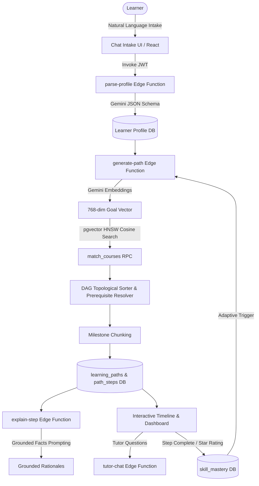

# System Design & Technical Specification

This document details the algorithms, mathematical models, AI prompt pipelines, and data flow of the **Personalized Learning Path Recommender**.

---

## 1. End-to-End Pipeline Architecture



---

## 2. Core Engine & Algorithms

### A. Semantic Course Retrieval (`pgvector` + Cosine Distance)
1. **Course Embeddings**: The catalog is embedded into a 768-dimensional vector space using Google Gemini embedding models (`gemini-embedding-001` / `text-embedding-004`).
2. **Goal Embedding**: Learner goals and target roles extracted during profiling are embedded in real time.
3. **Similarity Search**:
   $$\text{Cosine Distance}(u, v) = 1 - \frac{u \cdot v}{\|u\|_2 \|v\|_2}$$
   Postgres RPC query utilizes an **HNSW index** with cosine distance operator `<=>` to return top-$K$ candidate courses filtered by difficulty and user domain.

### B. Prerequisite DAG & Topological Sequencing (`pathGraph.js`)
Real learning is not a linear list of isolated recommendations; courses have strict prerequisite dependencies.

1. **Prerequisite Graph Formulation**: Represented as a Directed Acyclic Graph (DAG) $G = (V, E)$ where an edge $(u, v) \in E$ indicates course $u$ is a prerequisite for course $v$.
2. **Missing Prerequisite Injection**: If candidate set $S$ requires prerequisite $p \notin S$ and the learner has not already completed $p$, $p$ is dynamically pulled from the catalog into the learning path.
3. **Kahn's Topological Sort**:
   - Compute in-degrees for all target courses.
   - Maintain a zero in-degree queue.
   - Extract nodes, append to sequence, decrement neighbor in-degrees.
   - Cycle fallback: If cycles exist in custom catalog entries, remaining nodes are safely appended rather than dropped.
4. **Milestone Grouping**: Courses are segmented into cohesive milestone checkpoints (e.g., *Milestone 1: Foundations*, *Milestone 2: Core Engineering*, *Milestone 3: Advanced Applications*).

### C. Skill Gap Computation (`skillGap.js`)
$$\text{Skill Gap} = \text{Target Course Skills} \setminus \text{Learner Acquired Skills}$$
$$\text{Coverage Ratio} = \frac{|\text{Acquired Skills} \cap \text{Target Skills}|}{|\text{Target Skills}|}$$

---

## 3. Explainability & Grounding Architecture

To prevent LLM hallucination and ensure recommendations are trustworthy, the explanation engine uses **strict zero-shot grounding** (`_shared/grounding.js`):

1. **Context Extraction**:
   - Extract explicit learner facts: experience level, completed courses, expressed goals, and interests.
   - Extract explicit step facts: course title, difficulty, domain, taught skills, and prerequisite context.
2. **Constrained Prompting**:
   The LLM is prompted with strict instruction to formulate the rationale using **only** the provided facts:
   ```
   Rules:
   - Base your rationale ONLY on the learner facts and course facts provided above.
   - Do NOT invent unmentioned background, qualifications, or company requirements.
   - Output a JSON object mapping each course_id to its 2-3 sentence explanation.
   ```
3. **Batch Generation**:
   All steps in a generated path are explained in a single batch call with high output token capacity, eliminating latency and avoiding API quota issues.

---

## 4. Grounded AI Tutor (`tutor-chat`)

The conversational tutor assistant is bound to the learner's specific roadmap and profile context:
- Reads the learner's current path state, completed steps, and active milestones.
- Explains why specific courses were selected over others.
- Provides contextual study tips tailored to the current milestone.
- Falls back honestly when asked about out-of-scope topics or non-catalog courses.

---

## 5. Adaptive Feedback Loop & Skill Mastery

```
[Mark Step Complete] ───> +40 Base Mastery per Taught Skill
[Rate Course (1-5★)]  ───> +(Rating × 8) Mastery Points (Cap 100)
                              │
                              ▼
                     [Update skill_mastery Table]
                              │
                              ▼
                     [Trigger Re-Sequence]
                              │
                              ▼
           [Regenerate Path omitting Mastered Skills]
```

1. **Mastery Formula**:
   $$\text{Mastery}_{\text{new}} = \min\left(100, \text{Mastery}_{\text{current}} + \Delta_{\text{completion}} + \Delta_{\text{rating}}\right)$$
2. **Adaptive Re-sequencing**:
   When the learner clicks "Re-sequence Path", courses teaching already mastered skills are filtered out, and the prerequisite DAG dynamically re-computes to advance the learner toward higher-difficulty milestones.

---

## 6. Database Schema Summary

| Table | Primary Key | Description | RLS Policy |
| :--- | :--- | :--- | :--- |
| `courses` | `id` (UUID) | Catalog courses, domains, difficulty, duration, skills, 768-dim embeddings | Public Read, Service-Role Write |
| `prerequisites` | `(course_id, prerequisite_id)` | Directed graph edges | Public Read, Service-Role Write |
| `learner_profiles` | `id` (UUID) | User goals, experience level, target role, interests, completed courses | Scoped to `auth.uid() = user_id` |
| `learning_paths` | `id` (UUID) | Generated paths associated with a user | Scoped to `auth.uid() = user_id` |
| `path_steps` | `id` (UUID) | Steps in a path with milestone group, status, and rationales | Scoped via path ownership |
| `skill_mastery` | `(user_id, skill_name)` | Real-time skill mastery scores (0–100) | Scoped to `auth.uid() = user_id` |

---

## 7. Security & API Design

- **Authentication**: JWT-based via Supabase Auth with token validation at the Edge Function gateway.
- **Data Protection**: Postgres Row-Level Security (RLS) policies enforce per-user data isolation on all sensitive tables (`learner_profiles`, `learning_paths`, `path_steps`, `skill_mastery`).
- **AI Keys**: The `GEMINI_API_KEY` is stored as an encrypted secret in the Supabase Edge runtime and is never exposed to the client.
